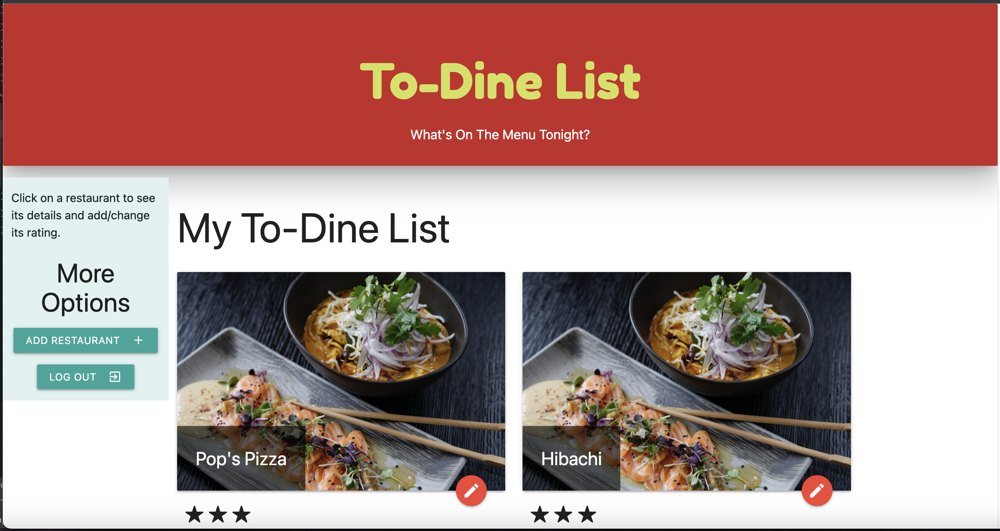

# To-Dine List

## Description

### Your foodie to-do list!

To-Dine List is a web app that allows users to log in and make a list of restaurants they would like to visit, then rate the restaurants and make notes about them after visiting. The goal was to make a site that could function as many things:

* Want to try something new on your next night out? Check your list for places you heard were good but then forgot about.

* Want a specific cuisine type or something in a particular area? Filter your list and check your notes for a particular restaurant to remember what you ate last time and whether it was good.

* Your friend wants to know which restaurant in town has the best Indian food? Look back at your ratings and make a recommendation they'll love.

We utilized Node.js with Express for API routing and Handlebars for views. We had only about 10 days to work on it outside of our day jobs and a few unpredictable life obstacles pop up, but you can see the implemented concept online at the live application link below.

[You can see the slides we used to present the site here.](https://docs.google.com/presentation/d/1pQNOm6zWVgTBbcgsuXlreUE6HeiNB5q8WpSbZ2Ge-hc/edit?usp=sharing)

## Live Application Link

[The application is deployed here via Heroku.](https://hidden-shelf-57015.herokuapp.com/)

## GitHub

[You can view my project repo here.](https://github.com/bpiper91/to-dine-list) It was forked from the [original repo](https://github.com/crisdege/to-dine-list) maintained by my teammate Cristina.

The team consisted of [Cristina Dege](https://github.com/crisdege), [Liliana Perez](https://github.com/o7lili), [Tien Ngo](https://github.com/Tien24196), [Alex Durham](https://github.com/Alex-Durham), and me.